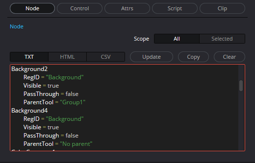

# Node Explorer for DaVinci Resolve/Fusion

## What is `NodeExplorer`?
* It is a **custom node** created for use in the Fusion page of DaVinci Resolve. It is based on Fusion's standard `AlphaDivide` node, with custom controls and an internal library added.
* Its purpose is to easily inspect and analyze nodes, controls, and their attributes during macro development.
* This tool does not participate in rendering. It can be safely removed from the composition at any time after use.

## Main Features

*   **Node**: Displays a list of all nodes or selected nodes in the composition, along with information such as `RegID`, `Visible`, and `PassThrough`.
*   **Control**: Lists the controls (UI elements) within a specified node. You can filter by control type (e.g., `SliderControl`, `ButtonControl`).
*   **Attrs**: Displays all attributes of a specific control (information obtainable with `GetAttrs()`) in detail.
*   **Script**: Easily retrieves and displays scripts set on a control (e.g., `Expression`, `OnChange`).
*   **Output Format Selection**: Allows you to display and copy inspection results in plain text, HTML table, or CSV format.
*   **Clipboard**: Copy all output results to the clipboard with a single click. It also includes a simple viewer to check the clipboard content.

## Installation

Save the `NodeExplorer_ver0.1.setting` file to any location and drag and drop it directly into the node editor on the Fusion page.

For repeated use, place the file in the DaVinci Resolve Macros folder to call it from the `Effects` panel at any time.
*   **Windows**: %APPDATA%\Blackmagic Design\DaVinci Resolve\Support\Fusion\Macros\
*   **macOS**: ~/Library/Application Support/Blackmagic Design/DaVinci Resolve/Fusion/Macros/
*   **Linux**: ~/.local/share/DaVinciResolve/Fusion/Macros/

## Table of Contents

- [How to Use Each Feature](#how-to-use-each-feature)
  - [Explorer Tab](#explorer-tab)
  - [Status Tab](#status-tab)
- [Use Cases for Each Output Format](#use-cases-for-each-output-format)
- [Processing Flow and Caching](#processing-flow-and-caching)
- [Version History](#version-history)
- [Technical Notes](#technical-notes)
- [Disclaimer](#disclaimer)
- [License and Redistribution](#license-and-redistribution)

## How to Use Each Feature

### On First Launch and Restart
`NodeExplorer` requires an initialization step on first launch and restart.
First, press the `POWER` button. The UI will appear if initialization is successful.


### Tab Structure
`NodeExplorer` consists of two tabs: `Explorer` and `Status`.
The `Explorer` tab has section display buttons at the top.
You can select one or more sections to display.

### Explorer Tab

#### 1. Node Section
Retrieves information about nodes in the composition.



*   **Scope**: Select `All` (all nodes) or `Selected` (selected nodes).
*   **Format**: Choose the output format from `TXT`, `HTML`, or `CSV`.
*   **Update**: Collects node information based on the settings and displays it in the text box below.
*   **Copy**: Copies the content of the text box to the clipboard.
*   **Clear**: Clears the content of the text box.

#### 2. Control Section
Retrieves information about the controls (UI elements in the Inspector) of a node.


*   **Input**: Select the type of control to inspect (e.g., `SliderControl`). Selecting `All` targets all types.
*   **Scope**: Select `All` (all nodes) or `Selected` (selected nodes).
*   **Format**: Choose the output format.
*   **Update**: Collects and displays control information based on the settings.

#### 3. Attrs Section

Inspects the attributes of a specific control in detail.


*   **Target**: Specify the target in `ToolName.InputID` format (e.g., `Background1.TopLeftRed`).
*   **Active**: Automatically fills the `Target` field with the name of the currently active (last clicked) node.
*   **Pickup**: You can right-click, select Expression, and drag the `+` icon to a control in the Inspector to automatically fill the `Target` field (this uses the Expression feature).
*   **Format**: Choose the output format.
*   **Update**: Collects and displays the attribute information for the control specified in `Target`.

#### 4. Script Section

Retrieves scripts associated with a control.


*   **Target**: Similar to the Attrs section, specify the target control in `ToolName.InputID` format.
*   **ScriptType**: Select the type of script to retrieve.
    -   `Expression`: Script set in the Expression.
    -   `Execute On Change`: Script set in INPS_ExecuteOnChange.
    -   `Button Execute (UserControl)`: BTNCS_Execute script set on a UserControl button.
*   **Get**: Retrieves and displays the script.

#### 5. Clipboard Section

A simple viewer to check the contents of the clipboard.


*   **Paste**: Pastes the current clipboard content into the viewer.
*   **Clear**: Clears the content of the viewer.

### Status Tab

Check the internal state and cache information of the tool.


*   **Cache Data**: `NodeExplorer` caches generated lists and formatted text to speed up redisplay. In this section, you can check the cache status of each data (`●`: cached / `○`: not cached) or clear individual caches. `Clear All Caches` deletes all caches at once.
*   **Library Loading**: Displays the loading status of the tool's internal library. "Loading success" is displayed if it is loaded correctly.
*   **Reload Library**: Reloads the library if it fails to load for some reason. This is disabled if the library is loaded correctly.

## Use Cases for Each Output Format

### Plain Text (TXT)
The default format. You can check information in simple text. It is also suitable for copying and pasting node names to specify targets within the tool.

It is also intended to be used by pasting into an external text editor via the clipboard. If there is information for multiple nodes, you can quickly jump to the information for each node by searching for `*****` (five asterisks) in the text editor's search function.

### HTML
The main purpose of this format is for simple display in the tool's clipboard viewer. The HTML source is displayed in the text box of each section, so you copy and use it.

You can also display the copied HTML source in an external browser. In that case, it is convenient to register the following JavaScript code as a bookmark (bookmarklet) in your browser.

```javascript
javascript: (function() {
  navigator.clipboard.readText().then(t => {
    const w = window.open('', '_blank');
    w.document.write(t);
    w.document.close();
  });
})();
```
When you open this bookmarklet with the HTML source copied to the clipboard, a new tab will open and you can view the content as a formatted table.

### CSV
This is a data format for use in spreadsheet software such as Excel and Google Sheets. When you want to find specific information from a large amount of data, you can use the powerful functions of spreadsheet software such as sorting and filtering.

Here are the steps for using it in Google Sheets:
1.  Create a new spreadsheet.
2.  Copy the desired information to the clipboard in CSV format with this tool.
3.  Select a cell in the sheet (usually A1) and paste the clipboard content.
4.  Click the icon that appears at the bottom right of the cell when pasting, and select **"Split text to columns"** from the menu.
5.  If necessary, you can format it as a table from the right-click menu to make it easier to read.

## Processing Flow and Caching

`NodeExplorer` actively uses caching to improve performance. The internal processing when you press the `Update` button or a format selection button is as follows.

### Processing when the `Update` button is pressed

1.  **Information Collection**: Collects node and control information from the composition based on the `Scope` setting (`All` / `Selected`).
2.  **List Cache Creation**: Converts the collected information into a list format data (Lua table) and saves it as a cache in the tool's internal data (CustomData).
3.  **Text Generation and Display**: Generates display text data from the list cache based on the currently selected `Format` (`TXT`/`HTML`/`CSV`).
4.  **Format Cache Creation**: Saves the generated text data as a cache for each format in the internal data and displays it in the text box.

### Processing when a `Format` selection button (TXT/HTML/CSV) is pressed

1.  **Format Cache Check**: Checks if a cache of text data corresponding to the selected format exists.
2.  **Cache Usage**: If the cache exists, it is displayed directly in the text box. This allows for fast switching of the display without the need for recalculation.
3.  **If there is no cache**:
    *   Checks if a cache of list data (created with the `Update` button) exists.
    *   If the list cache exists, it is used to newly generate and display the text data of the requested format. At the same time, it is saved as a new format cache.
    *   If the list cache also does not exist (e.g., if `Update` has never been pressed), a message prompting you to press the `Update` button is displayed.

The status of these caches can be checked and cleared individually in the `Status` tab.

## Version History

### ver 0.1 (2025-09-04)

*   Initial release

## Technical Notes

*   The clipboard viewer built into the tool is intended for simple display only.
*   Due to the nature of Fusion's UI rendering, displaying a large amount of data in the clipboard viewer may cause it to become slow.
*   In particular, HTML tables are expensive to draw, so it is recommended to display large tables of **more than 200 rows** in an external web browser via the clipboard.

## Disclaimer
*   The creator assumes no responsibility for any damage or failure caused by the use of this tool. Please use it at your own risk.

## License and Redistribution
*   There are no particular restrictions on the use of this tool. You are free to use, modify, and redistribute it for personal or commercial use.
*   However, this does not prevent the creator from distributing and using this tool.
